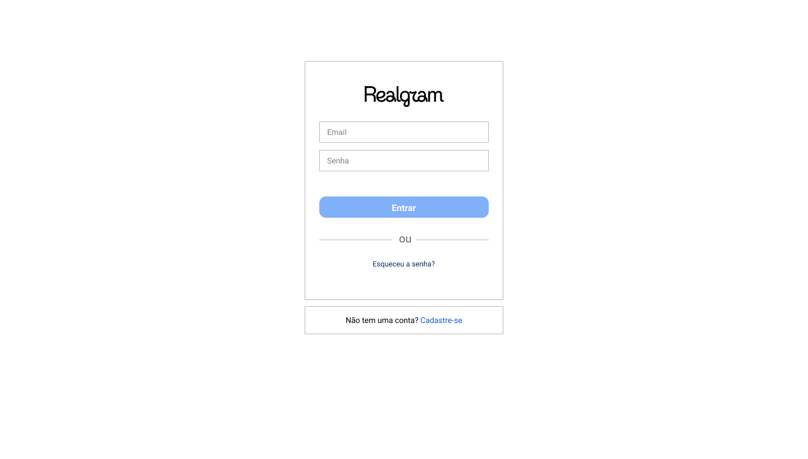

# Social Network - Realgram




> O objetivo desta aplicação é aprimorar as habilidades em engenharia de software por meio da utilização do modelo de desenvolvimento evolutivo incremental para criar uma plataforma semelhante ao Instagram. Os requisitos do projeto foram estabelecidos com base em conversas detalhadas com o cliente, resultando na elaboração de um documento de especificação de requisitos que servirá como base para o desenvolvimento das funcionalidades.

## 💻 Feito Com:


## 📖 Documentação

- [Plano de Iterações](./docs/Plano%20de%20Itera%C3%A7%C3%B5es/Grupo-04-Plano-de-Itera%C3%A7%C3%B5es.pdf)
- [Tutorial das Ferramentas](./docs/Tutoriais/Tutorial%20Completo%20-%20Grupo%2004.pdf)
- [Especificação de Requisitos de Software - ERSw](./docs/ERSw/E.S.%20II%20-%20Eqp.%2004%20-%20Especifica%C3%A7%C3%B5es.pdf)

## 💻 Pré-requisitos

Antes de começar, verifique se você atendeu aos seguintes requisitos:

- [`< Git >`](https://git-scm.com/)
- [`< Node 18+ >`](https://nodejs.org/)
- [`< Nodemon >`](https://nodemon.io/)

## 🚀 Baixando e Rodando o Projeto

Para baixar o projeto, utilize o comando:

```
git clone https://github.com/es20231/eqp4.git
```

Dentro da pasta do repositório, siga estas etapas:

- Para iniciar o servidor front-end:

```
cd realgram-frontend

npm install

npm run serve
```

- Para iniciar o servidor back-end:

```
cd realgram-backend

npm install

npm run serve
```

## 📫 Contribuindo com o Projeto

Para contribuir com o projeto, siga estas etapas:

1. Bifurque este repositório.
2. Crie um branch: `git checkout -b <nome_branch>`.
3. Faça suas alterações e confirme-as: `git commit -m '<mensagem_commit>'`
4. Envie para o branch original: `git push origin main`
5. Crie a solicitação de pull.

Como alternativa, consulte a documentação do GitHub em [como criar uma solicitação pull](https://help.github.com/en/github/collaborating-with-issues-and-pull-requests/creating-a-pull-request).

## 🤝 Colaboradores

As seguintes pessoas contribuíram para este projeto:

<table>
  <tr>
  <!-- Prof. Armando Recife -->
    <td align="center">
      <a href="https://github.com/armandossrecife">
        <br>
        <sub>
          <b>Prof. Armando Recife</b>
        </sub>
      </a>
    </td>
  <!-- Pumba Developer -->
    <td align="center">
      <a href="https://github.com/pumba-dev">
        <br>
        <sub>
          <b>Paulo Eduardo</b>
        </sub>
      </a>
    </td>
    <!-- Carlos Sávio -->
    <td align="center">
      <a href="https://github.com/csfr7">
        <br>
        <sub>
          <b>Carlos Sávio</b>
        </sub>
      </a>
    </td>
    <!-- Vicente Carvalho -->
    <td align="center">
      <a href="https://github.com/vicenttcarvalho">
        <br>
        <sub>
          <b>Vicente Carvalho</b>
        </sub>
      </a>
    </td>
    <!-- Gabriel Reis -->
    <td align="center">
      <a href="https://github.com/usernamegran">
        <br>
        <sub>
          <b>Gabriel Reis</b>
        </sub>
      </a>
    </td>
    <!-- Paulo Vale -->
    <td align="center">
      <a href="https://github.com/lpaulovale">
        <br>
        <sub>
          <b>Paulo Vale</b>
        </sub>
      </a>
    </td>
  </tr>
</table>

## 💰 Donate

[](https://picpay.me/pumbadev)

## 📝 Licença

Copyright © 2023 Pumba Developer

[⬆ Voltar ao topo](#)<br>
